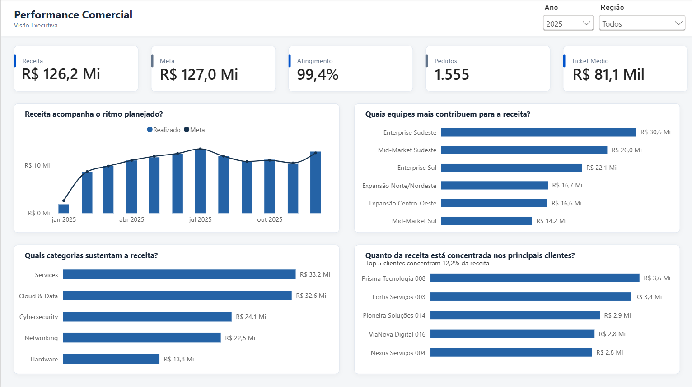
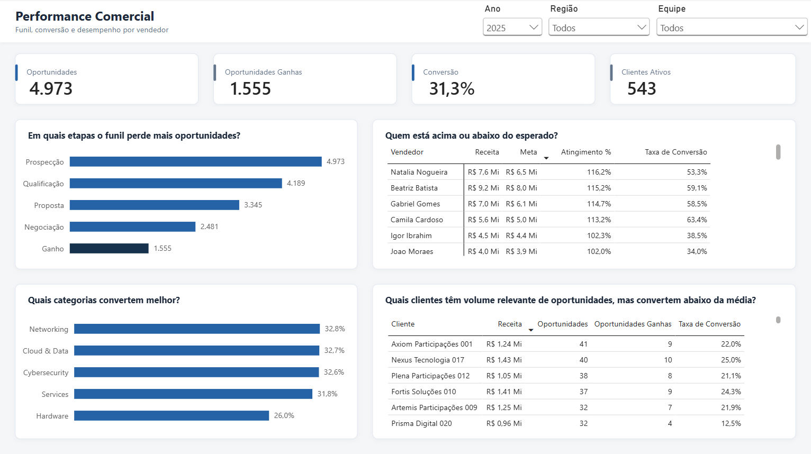

# Commercial Performance & Sales Funnel | Power BI

Dashboard desenvolvido em Power BI para análise de performance comercial, metas, funil de vendas, vendedores, categorias e concentração de receita.

> **Nota:** os dados deste projeto são sintéticos e foram criados exclusivamente para estudo e portfólio. Não representam informações de uma empresa real.

## Visão geral

O projeto foi construído para responder perguntas de negócio como:

- A receita está acompanhando a meta?
- Quais equipes e categorias mais contribuem para o resultado?
- A receita está concentrada em poucos clientes?
- Em quais etapas o funil perde mais oportunidades?
- Quais vendedores performam acima ou abaixo do esperado?
- Quais clientes possuem volume relevante de oportunidades, mas conversão abaixo da média?

## Dashboard

### 1. Visão Executiva

A primeira página concentra a leitura de resultado:

- Receita, meta e atingimento
- Pedidos e ticket médio
- Evolução mensal de realizado x meta
- Receita por equipe
- Receita por categoria
- Concentração nos principais clientes

### 2. Performance Comercial

A segunda página aprofunda o diagnóstico:

- Funil comercial
- Oportunidades ganhas e taxa de conversão
- Performance por vendedor
- Conversão por categoria
- Clientes com alto volume de oportunidades e conversão abaixo da média

## Principais insights

Considerando o ano de 2025:

- Receita de **R$ 126,2 milhões** frente a uma meta de **R$ 127,0 milhões**, atingindo **99,4%**.
- **Enterprise Sudeste** foi a equipe com maior contribuição para a receita.
- **Services** e **Cloud & Data** foram as categorias com maior faturamento.
- Os cinco maiores clientes concentraram **12,2% da receita**.
- Das **4.973 oportunidades**, **1.555 foram ganhas**, resultando em taxa de conversão de **31,3%**.
- **Hardware** apresentou conversão de **26,0%**, abaixo das demais categorias analisadas.
- Foram identificados clientes com volume relevante de oportunidades e conversão significativamente abaixo da média, permitindo direcionar uma investigação comercial mais específica.

## Modelagem

O modelo foi estruturado em estrela, com dimensões compartilhadas e três tabelas fato com granularidades diferentes:

- `FactSales`: 1 linha por item de pedido
- `FactPipeline`: 1 linha por oportunidade por etapa alcançada
- `FactTargets`: 1 linha por vendedor por mês

Dimensões:

- `DimDate`
- `DimCustomer`
- `DimProduct`
- `DimSeller`

A separação permite analisar vendas, pipeline e metas sem misturar processos com granularidades diferentes.

## Principais medidas DAX

- Receita
- Receita Ano Anterior
- Crescimento YoY %
- Meta
- Atingimento da Meta %
- Gap para Meta
- Pedidos
- Ticket Médio
- Oportunidades
- Oportunidades Ganhas
- Oportunidades Perdidas
- Taxa de Conversão
- Conversão vs. Etapa Anterior %
- Concentração Top 5 Clientes %

## Tecnologias

- Power BI
- Power Query
- DAX
- Modelagem dimensional

## Dados

O cenário sintético representa uma operação comercial B2B com:

- 40 vendedores
- 6 equipes comerciais
- 700 clientes
- 50 produtos
- mais de 8 mil oportunidades
- histórico de 2025 e 2026

## Arquivo do dashboard

O arquivo `.pbix` está disponível em `dashboard/commercial-performance.pbix`.

## Autor

**André Tavares**

Projeto desenvolvido para portfólio em Data Analytics / Business Intelligence.
